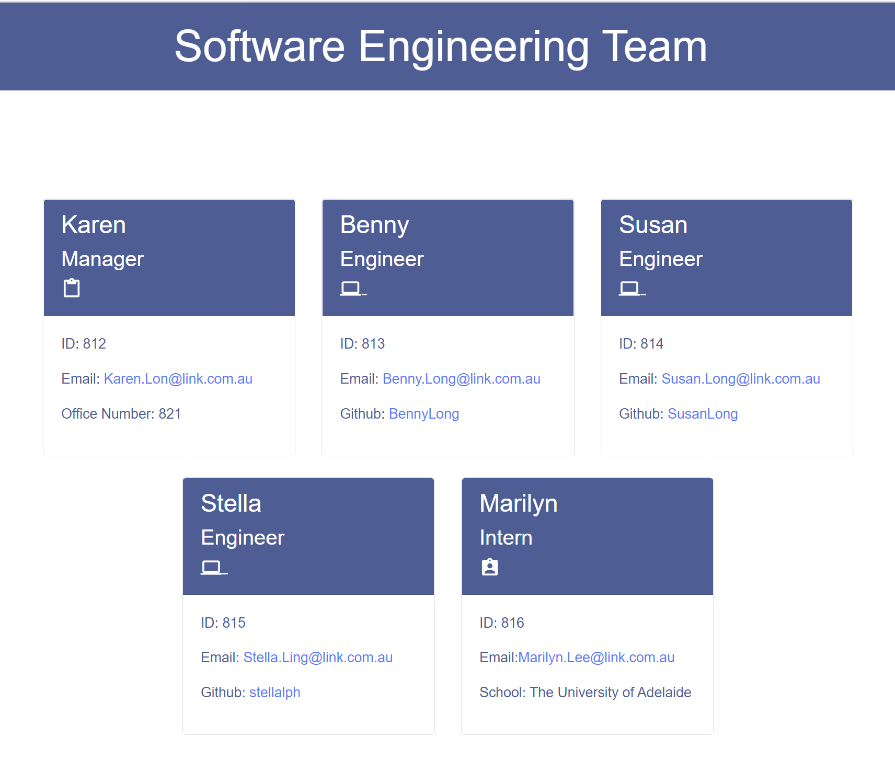
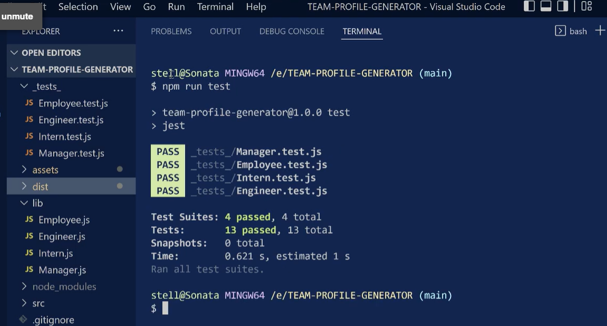
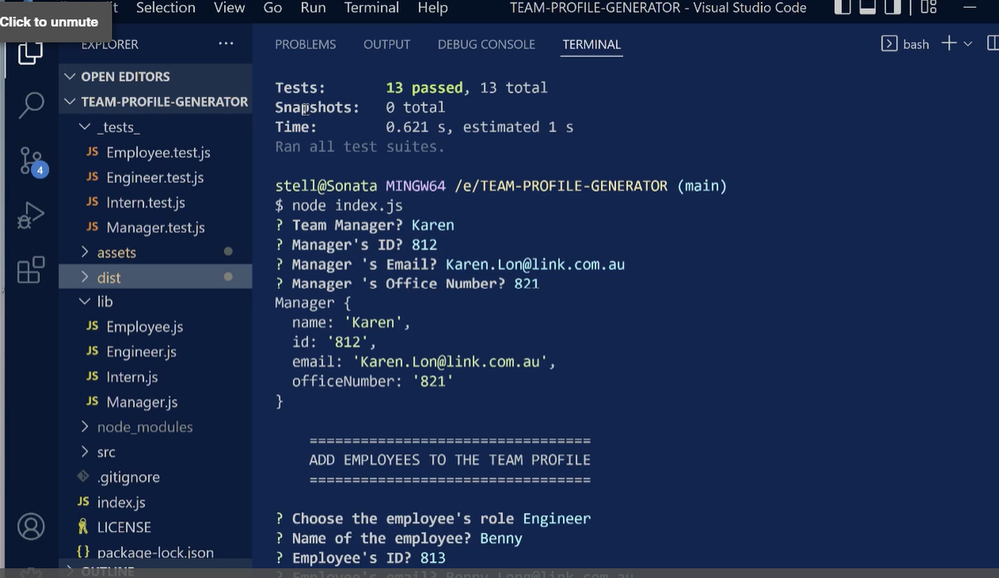
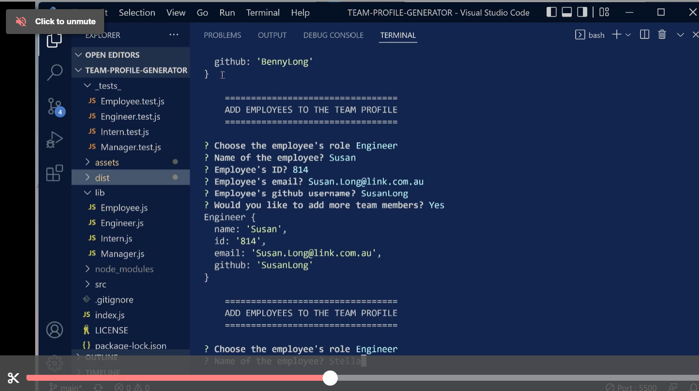
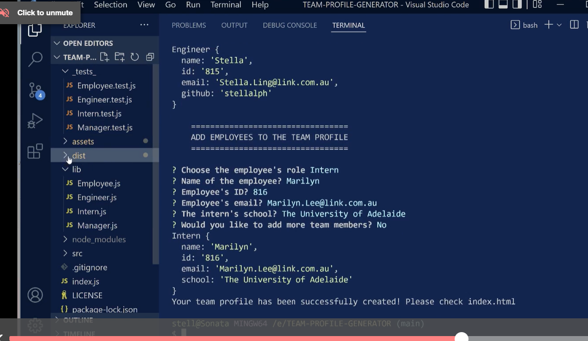

# Team Profile Generator

[](https://opensource.org/licenses/MIT)

## Description

The task of this project is to build a Node.js command-line application that takes in information about employees on a software engineering team.  This application was created to generate a team profile based on the user 's input using the inquirer module and then generates an HTML webpage that would display summaries for each person.  This project would demonstrates the use of the OOP (Object-oriented Programming) and TDD (Test Driven Development) using testing framework Jest which is designed to write, run tests and report results of those tests according to the user story and acceptance criteria.


   * <strong><em>User Story</em></strong>

```mdg
AS A manager
I WANT to generate a webpage that displays my team's basic info
SO THAT I have quick access to their emails and GitHub profiles
```

   * <strong><em>Acceptance Criteria</em></strong>

```md
GIVEN a command-line application that accepts user input
WHEN I am prompted for my team members and their information
THEN an HTML file is generated that displays a nicely formatted team roster based on user input
WHEN I click on an email address in the HTML
THEN my default email program opens and populates the TO field of the email with the address
WHEN I click on the GitHub username
THEN that GitHub profile opens in a new tab
WHEN I start the application
THEN I am prompted to enter the team manager’s name, employee ID, email address, and office number
WHEN I enter the team manager’s name, employee ID, email address, and office number
THEN I am presented with a menu with the option to add an engineer or an intern or to finish building my team
WHEN I select the engineer option
THEN I am prompted to enter the engineer’s name, ID, email, and GitHub username, and I am taken back to the menu
WHEN I select the intern option
THEN I am prompted to enter the intern’s name, ID, email, and school, and I am taken back to the menu
WHEN I decide to finish building my team
THEN I exit the application, and the HTML is generated
```

   * <strong><em>Sample of the HTML webpage generated:-</em></strong>



## Table of Contents
* [Installation](#installation)
* [Tests](#tests)
* [Usage](#usage)
* [Contributing](#contributing)
* [Questions](#questions)
* [License](#license)

## Installation

To start creating this application, the directory structure will be set up as below.

```md
.
├── __tests__/             //jest tests
│   ├── Employee.test.js
│   ├── Engineer.test.js
│   ├── Intern.test.js
│   └── Manager.test.js
├── dist/                  // rendered output (HTML) and CSS style sheet      
├── lib/                   // classes
├── src/                   // template helper code 
├── .gitignore             // indicates which folders and files Git should ignore
├── index.js               // runs the application
└── package.json           
```     
This application will need the installation of node.js and npm install (install a package and its dependencies).  The steps are

 * npm init
 * npm install

 This team profile generator also uses the inquirer dependencies which need to be installed. 

 * npm i inquirer

 This will collect the input from the user and the application will be invoked by using the following command:

 * node index.js

 The application also uses jest for running the unit tests which is also be installed by the following command:-

 * npm i jest

## Tests

This team profile generator uses jest for running the unit tests, that is, at command prompt

 * npm run test

to ensure the tests are passed.



## Usage

The application uses Inquirer for collecting user inputs. The application will be invoked by using the following command:-

* node index.js

The user will be requested to input information about the team as per the screenshots:-

1.
2. 
3. 

After all the inputs have been completed, an index.html file be created from the user's input and will be in dist folder.

A sample copy of the generated HTML file is placed under <strong>Description</strong> section.

The link to the video to show the walkthrough of the user 's input to generate team profile.

Please click on the link <strong> VIDEO </strong> below to access the video.

 * [VIDEO](https://drive.google.com/file/d/12uStfXkUXP2aIxcdN2ObYhpOpHtkvGL9/view)

The repository name is Team-Profile-Generator and the URL of the GitHub repository is https://github.com/stellalph/Team-Profile-Generator.git

* [URL GitHub repository](https://github.com/stellalph/Team-Profile-Generator.git)


https://drive.google.com/file/d/12uStfXkUXP2aIxcdN2ObYhpOpHtkvGL9/view


## Contributing

## Questions

Contact email: stella.ling@outlook.com

GitHub: [stellalph](https://github.com/stellalph)


Node.js Crash Course, Jest Crash Course (Online Tutorial)

## License
  
This project is licensed under the terms of the MIT license.

## References


