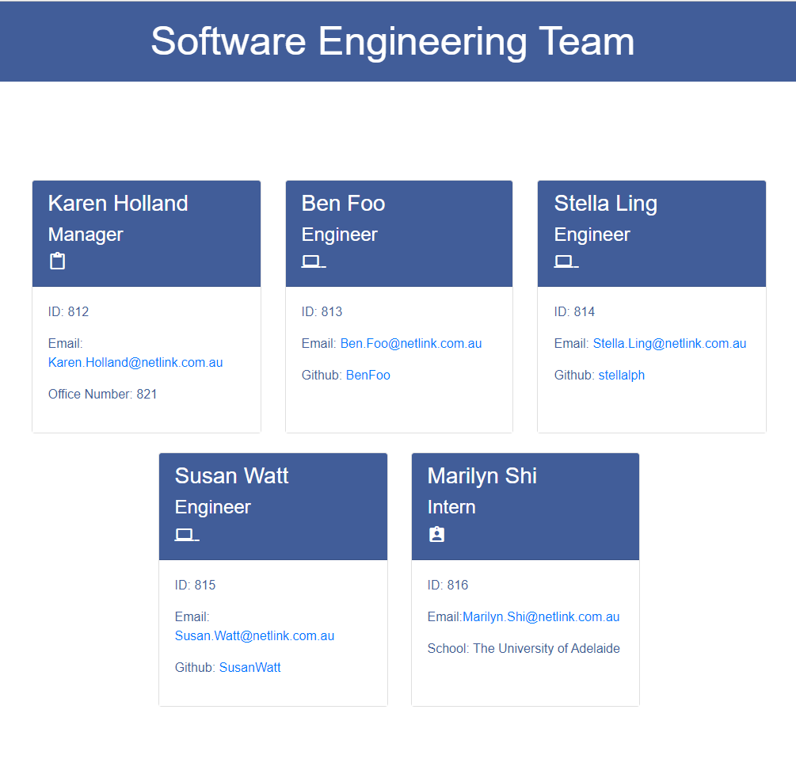

# Team Profile Generator

[](https://opensource.org/licenses/MIT)

## Description

The task of this project is to build a Node.js command-line application that takes in information about employees on a software engineering team.  This application was created to generate a team profile based on the user 's input using the inquirer module and then generates an HTML webpage that would display summaries for each person.  This project would demonstrates the use of the OOP (Object-oriented Programming) and TDD (Test Driven Development) using testing framework Jest which is designed to write, run tests and report results of those tests according to the user story and acceptance criteria.

<strong><em>User Story</em></strong>

```mdg
AS A manager
I WANT to generate a webpage that displays my team's basic info
SO THAT I have quick access to their emails and GitHub profiles
```

<strong>Acceptance Criteria</strong>

```md
GIVEN a command-line application that accepts user input
WHEN I am prompted for my team members and their information
THEN an HTML file is generated that displays a nicely formatted team roster based on user input
WHEN I click on an email address in the HTML
THEN my default email program opens and populates the TO field of the email with the address
WHEN I click on the GitHub username
THEN that GitHub profile opens in a new tab
WHEN I start the application
THEN I am prompted to enter the team manager’s name, employee ID, email address, and office number
WHEN I enter the team manager’s name, employee ID, email address, and office number
THEN I am presented with a menu with the option to add an engineer or an intern or to finish building my team
WHEN I select the engineer option
THEN I am prompted to enter the engineer’s name, ID, email, and GitHub username, and I am taken back to the menu
WHEN I select the intern option
THEN I am prompted to enter the intern’s name, ID, email, and school, and I am taken back to the menu
WHEN I decide to finish building my team
THEN I exit the application, and the HTML is generated
```

<strong>Overview of The HTML webpage generated:-</strong>



## Table of Contents
* [Installation](#installation)
* [Usage](#usage)
* [Tests](#tests)
* [Contributing](#contributing)
* [Questions](#questions)
* [License](#license)

## Installation
Install npm, npm i inquirer and npm i jest  

## Usage

## Tests
Do npm run test until all the tests are passed.


## Contributing

## Questions

Contact email: stella.ling@outlook.com

GitHub: [stellalph](https://github.com/stellalph)


Node.js Crash Course, Jest Crash Course (Online Tutorial)

## License
  
This project is licensed under the terms of the MIT license.

## References

Node.js Crash Course, Jest Crash Course (Online Tutorial)